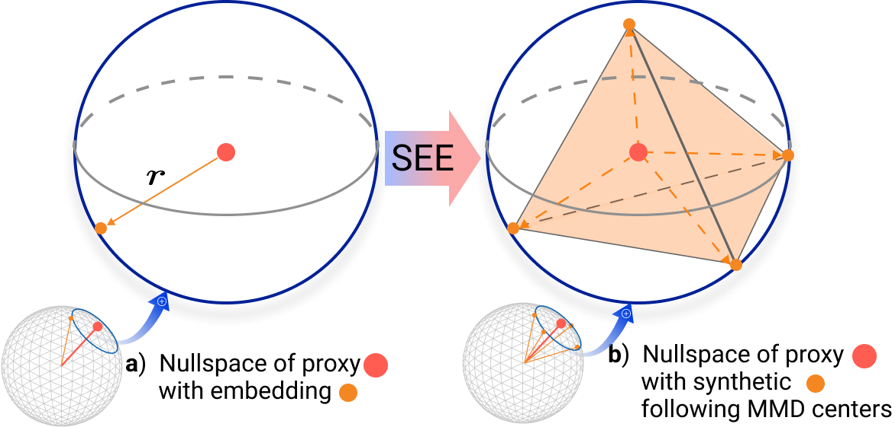

# SEE: Spherical Embedding Expansion for Improving Deep Metric Learning (ID: 1140)

  <h4> Anonymous submission

 

## Overview

  

### Experimental Results

| Methods | Arch. | CUB |  |  | Cars |  |  | SOP |  |  | In-Shop |  |  |
| :---: | :---: | :---: | :---: | :---: | :---: | :---: | :---: | :---: | :---: | :---: | :---: | :---: | :---: |
|  |  | $\mathrm{R} @ 1$ | $\mathrm{R} @ 2$ | $\mathrm{R} @ 4$ | R@1 | $\mathrm{R} @ 2$ | $\mathrm{R} @ 4$ | $\mathrm{R} @ 1$ | $\mathrm{R} @ 10$ | $\mathrm{R} @ 100$ | R@1 | $\mathrm{R} @ 10$ | $\mathrm{R} @ 20$ |
| Backbone architecture: $C N N$ |  |  |  |  |  |  |  |  |  |  |  |  |  |
| NSoftmax | $\mathrm{R}^{128}$ | 56.5 | 69.6 | 79.9 | 81.6 | 88.7 | 93.4 | 75.2 | 88.7 | 95.2 | 86.6 | 96.8 | 97.8 |****
| MIC  | $\mathrm{R}^{128}$ | 66.1 | 76.8 | 85.6 | 82.6 | 89.1 | 93.2 | 77.2 | 89.4 | 94.6 | 88.2 | 97.0 | - |
| XBM  | $\mathrm{R}^{128}$ | - | - | - | - | - | - | 80.6 | 91.6 | 96.2 | 91.3 | 97.8 | 98.4 |
| $\mathrm{XBM}$ | $\mathrm{B}^{512}$ | 65.8 | 75.9 | 84.0 | 82.0 | 88.7 | 93.1 | 79.5 | 90.8 | 96.1 | 89.9 | 97.6 | 98.4 |
| HTL | $\mathrm{B}^{512}$ | 57.1 | 68.8 | 78.7 | 81.4 | 88.0 | 92.7 | 74.8 | 88.3 | 94.8 | 80.9 | 94.3 | 95.8 |
| MS | $\mathrm{B}^{512}$ | 65.7 | 77.0 | 86.3 | 84.1 | 90.4 | 94.0 | 78.2 | 90.5 | 96.0 | 89.7 | 97.9 | 98.5 |
| SoftTriple  | $\mathrm{B}^{512}$ | 65.4 | 76.4 | 84.5 | 84.5 | 90.7 | 94.5 | 78.6 | 86.6 | 91.8 | - | - | - |
| PA  | $\mathrm{B}^{512}$ | 68.4 | 79.2 | 86.8 | 86.1 | 91.7 | 95.0 | 79.1 | 90.8 | 96.2 | 91.5 | 98.1 | 98.8 |
| NSoftmax | $\mathrm{R}^{512}$ | 61.3 | 73.9 | 83.5 | 84.2 | 90.4 | 94.4 | 78.2 | 90.6 | 96.2 | 86.6 | 97.5 | 98.4 |
| ${ }^{\dagger}$ ProxyNCA++  | $\mathrm{R}^{512}$ | 69.0 | 79.8 | 87.3 | 86.5 | 92.5 | 95.7 | 80.7 | 92.0 | 96.7 | 90.4 | 98.1 | 98.8 |
| Hyp | $\mathrm{R}^{512}$ | 65.5 | 76.2 | 84.9 | 81.9 | 88.8 | 93.1 | 79.9 | 91.5 | 96.5 | 90.1 | 98.0 | 98.7 |
| SEE (ours) | $\mathrm{R}^{512}$ | 69.3 | 79.0 | 87.3| 88.5| 93.4| 95.9 |80.3| 91.5| 96.5 |92.8| 98.3 |98.8|
| Backbone architecture: ViT |  |  |  |  |  |  |  |  |  |  |  |  |  |
| $\mathrm{IRT}_{\mathrm{R}}$ | $\mathrm{De}^{128}$ | 72.6 | 81.9 | 88.7 | - | - | - | 83.4 | 93.0 | 97.0 | 91.1 | 98.1 | 98.6 |
| Нyp  | $\mathrm{De}^{128}$ | 74.7 | 84.5 | 90.1 | 82.1 | 89.1 | 93.4 | 83.0 | 93.4 | 97.5 | 90.9 | 97.9 | 98.6 |
| SEE (ours) | $\mathrm{De}^{128}$ |75.1| 84.1| 90.1 |85.7| 91.5| 94.8| 83.0| 93.1 |97.2 |91.2| 98.0 |98.6|
| Hyp  | $\mathrm{DN}^{128}$ | 78.3 | 86.0 | 91.2 | 86.0 | 91.9 | 95.2 | 84.6 | 94.1 | 97.7 | 92.6 | 98.4 | 99.0 |
| SEE (ours) | $\mathrm{DN}^{128}$ | 78.8| 86.5 |91.6 |89.0| 93.6 |96.3 |84.8 |94.1 |97.5 |92.6 |98.6 |99.0 |
| Hyp  | $\mathrm{V}^{128}$ | 84.0 | 90.2 | 94.2 | 82.7 | 89.7 | 93.9 | 85.5 | 94.9 | 98.1 | 92.7 | 98.4 | 98.9 |
| SEE (ours) | $\mathrm{V}^{128}$ | 84.1 |90.2 |93.5 |86.8 |91.7 |95.1 |85.9 |94.7 |97.9 |92.8 |98.6 |99.1 |
| $\mathrm{IRT}_{\mathrm{R}}$ | $\mathrm{De}^{384}$ | 76.6 | 85.0 | 91.1 | - | - | - | 84.2 | 93.7 | 97.3 | 91.9 | 98.1 | 98.9 |
| DeiT-S  | $\mathrm{De}^{384}$ | 70.6 | 81.3 | 88.7 | 52.8 | 65.1 | 76.2 | 58.3 | 73.9 | 85.9 | 37.9 | 64.7 | 72.1 |
| Hyp  | $\mathrm{De}^{384}$ | 77.8 | 86.6 | 91.9 | 86.4 | 92.2 | 95.5 | 83.3 | 93.5 | 97.4 | 90.5 | 97.8 | 98.5 |
| SEE (ours) | $\mathrm{De}^{384}$ | 78.3 | 86.5 | 91.9 | 88.8 | 93.7 | 96.3 | 83.6 | 93.4 | 97.4 | 91.7 | 98.1 | 98.7 |
| DINO| $\mathrm{DN}^{384}$ | 70.8 | 81.1 | 88.8 | 42.9 | 53.9 | 64.2 | 63.4 | 78.1 | 88.3 | 46.1 | 71.1 | 77.5 |
| Нур  | $\mathrm{DN}^{384}$ | 80.9 | 87.6 | 92.4 | 89.2 | 94.1 | 96.7 | 85.1 | 94.4 | 97.8 | 92.4 | 98.4 | 98.9 |
| SEE (ours) | $\mathrm{DN}^{384}$ | 81.9| 88.8 |92.9 |91.5| 95.2 |97.3 |85.5 |94.6| 97.9| 93.0 |98.5 |99.1 |
| ViT-S  | $\mathrm{v}^{384}$ | 83.1 | 90.4 | 94.4 | 47.8 | 60.2 | 72.2 | 62.1 | 77.7 | 89.0 | 43.2 | 70.2 | 76.7 |
| Hyp | $\mathrm{V}^{384}$ | 85.6 | 91.4 | 94.8 | 86.5 | 92.1 | 95.3 | 85.9 | 94.9 | 98.1 | 92.5 | 98.3 | 98.8 |
| SEE (ours) | $\mathrm{V}^{384}$ | 85.8| 91.4| 94.6 |88.8 |93.8| 96.4| 86.3| 95.0| 98.2| 93.2| 98.6| 99.1 |

## Installation
See [environment.yml](environment.yml) for installation details.

## Datasets
1. Download four public benchmarks for deep metric learning
   - [CUB-200-2011](http://www.vision.caltech.edu/visipedia-data/CUB-200-2011/CUB_200_2011.tgz)
   - Cars-196 ([Img](http://imagenet.stanford.edu/internal/car196/car_ims.tgz), [Annotation](http://imagenet.stanford.edu/internal/car196/cars_annos.mat))
   - Stanford Online Products ([Link](https://cvgl.stanford.edu/projects/lifted_struct/))
   - In-shop Clothes Retrieval ([Link](http://mmlab.ie.cuhk.edu.hk/projects/DeepFashion.html))

2. Extract the tgz or zip file into `./data/` (Exceptionally, for Cars-196, put the files in a `./data/cars196`)

## Training Embedding Network

See [scripts](scripts) folder to train embedding model with Proxy-Anchor loss and SEE on a single node with 2 gpus

## Acknowledgements

Our source code is modified and adapted on these great repositories:

- [Hyperbolic Vision Transformers: Combining Improvements in Metric Learning](https://github.com/htdt/hyp_metric)
- [Proxy Anchor Loss for Deep Metric Learning](https://github.com/tjddus9597/Proxy-Anchor-CVPR2020)

